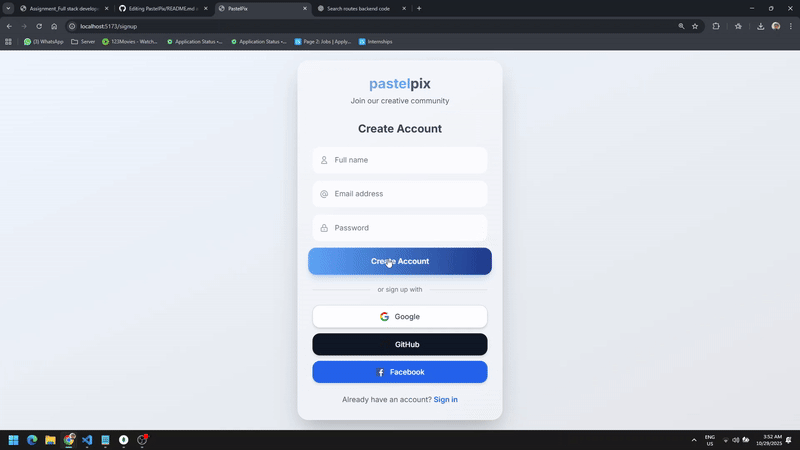

# PastelPix
A Modern Web app that lets users log in, search for high-quality images via the Unsplash API, and view personalized search history along with trending searches across all users. It combines secure authentication (including OAuth) with a sleek, minimal, and responsive design for a seamless browsing experience.

## ⚙️ Setup Instructions

1️⃣ Clone the repository  
2️⃣ Install dependencies  
3️⃣ Run the Local Servers

For /server ( backend ) :
```
cd server
npm install
npm start
```

For /client ( frontend ) :
```
cd frontend
npm install
npm run dev
```

## API KEYS :
UNSPLASH_ACCESS_KEY = "jPpxVf-IPYGFYlflPH3Nfg3uWTmy3pSCCSmdYS0ZLfo";  
GOOGLE_CLIENT_ID=998429887437-4jjfrqnihs0nr6dc35n23s8lvb44keh5.apps.googleusercontent.com  
GOOGLE_CLIENT_SECRET=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  
GITHUB_CLIENT_ID=Ov23liTNZv1ckDtIQ3tQ  
GITHUB_CLIENT_SECRET=16daa13bc38becf44aad65ba9116733fe39343ba

I Didn't Integrate Facebook for specific reasons.

## Explanation of Folder Structure  

Backend :  
I usually use this model-controller-route structure for backends, firstly building the model schemas, then building the functional controller and then routing each controller to URLs and then Finally Calling them all in Server.js  

Frontend :  
For Frontend I have used Component folder for reusable component like Navbar, Header, Footer, etc. Pages folder for Complete Pages assigned to a URL like Home, Login, Signup and Services folder for reusable context or API works.

# Visual Proofs :

## OAuthLogin


## MultiSelect


## Search History

